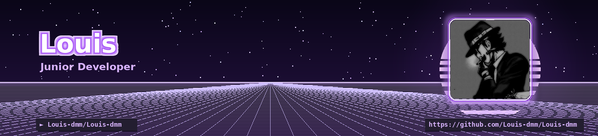

  

<h1 align="center">
  Hey there, I'm Louis 👋
</h1>

  

  
  
  

---

<h2 align="center">👨‍💻 About Me</h2>

<table align="center" border="0">
<tr>

<td width="65%" valign="top">

- 🚀 **Passionate Junior Developer:** Constantly learning, driven by understanding core system internals and crafting impactful applications.
- 🛠️ **From Low-Level to Web:** Comfortable with the precision of C and Linux environments, while building modern web projects (JavaScript, PHP, Python, Java).
- ⚙️ **Automation & Tooling:** Writing Python automation scripts, containerizing with Docker, and leveraging modern developer tooling (Claude, Git, VS Code).
- 🎯 **Builder Mindset:** Bridging theoretical concepts with real-world functional code.
- ✨ *Curious, methodical, and always eager to take on new technical challenges.*

</td>

<td width="35%" align="center" valign="middle">

</td>

</tr>
</table>

---

<h2 align="center">💻 Tech Stack & Tools</h2>

  
  

---

<h2 align="center">📈 GitHub Streak Analytics</h2>

  

---

<h2 align="center">🐍 Contribution Graph</h2>

  <picture>
    <source media="(prefers-color-scheme: dark)" srcset="https://raw.githubusercontent.com/Louis-dmm/Louis-dmm/output/github-snake-dark.svg" />
    <source media="(prefers-color-scheme: light)" srcset="https://raw.githubusercontent.com/Louis-dmm/Louis-dmm/output/github-snake.svg" />
    
  </picture>

---

<h2 align="center">🌐 Let's Connect</h2>

  
  &nbsp;&nbsp;
  

  <i>See you in the next commit 🚀</i>

  

